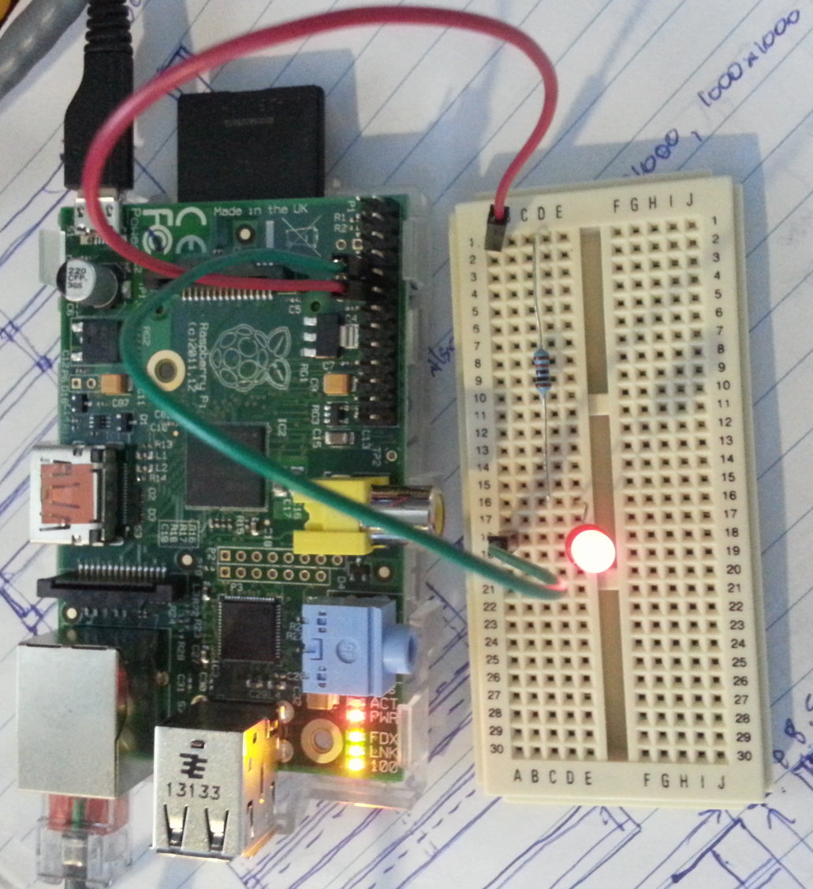

blink-led
=========

Simple script for a initializing a function that blinks an LED via a Raspberry Pi GPIO pin. Inpsired by Scott Mangold's article [Lighting Up An Led Using Your Raspberry Pi and Python](http://www.thirdeyevis.com/pi-page-2.php)

Assumes that an LED and suitable resistor are in series from the chosen GPIO pin and terminated at GND (can use pins 6,9,14,20,25 for GND). See [RPi Low-level peripherals](http://elinux.org/RPi_Low-level_peripherals) for more information on GPIO hardware.

Dependancies
------------
raspberry-gpio-python
```bash
$ sudo apt-get update
$ sudo apt-get dist-upgrade
$ sudo apt-get install python-rpi.gpio python3-rpi.gpio
```

Usage
-----
Must be executed by root or user with permission to output to GPIO pins.
When blink.py is either imported or executed within the python/ipython shell, the 'blink()' function becomes available:
blink(count, period, pin_num=11)
outputs blinks to an LED via a GPIO pin (default pin 11)
count = number of LED blinks
period = number of seconds for each LED blink
pin_num = GPIO pin number to output blink to

Example:
```python
from blink import blink
blink(5,1) # will make the LED blink 5 times, holding for 1 second per blink, output to GPIO pin 11 by default
blink(3,2,7) # will make the LED blink 3 times, holding for 2 seconds per blink, output to GPIO pin 7
```
